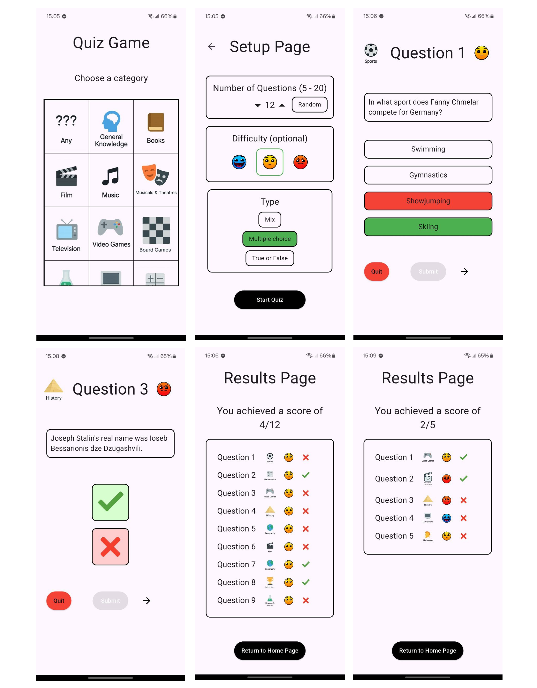

# Quiz Game

Quiz Game - Metti alla prova le tue conoscenze in una serie infinita di quiz che coinvologno le più svariate categorie di domande. Divertiti e impara giocando!

## Screenshots


## Svolgimento del gioco

Nella HomePage il giocatore ha davanti a sé una tabella con 25 categorie di domande (vedi [Categorie](#Categorie)) di cui deve selezionarne una.
Dopodiché viene reindirizzato alla SetupPage in cui imposta le sue preferenze sul quiz:
* Numero di domande -> da 5 a 20, o Random
* Difficoltà -> ‘Easy’, ‘Medium o ‘Hard’ (se non viene selezionata le domande saranno miste)
* Tipo di domande-> ‘Mix’, ‘Multiple choice’ o ‘Boolean’ (T/F)

Una volta terminato il Setup, le domande vengono richieste al database di [OpenTriviaDB](https://opentdb.com/) e il quiz ha Inizio.
Le domande vengono poste in sequenza e per avanzare alla successiva è necessario prima fare il Submit di quella corrente.
Alla fine del quiz il giocatore viene portato alla ResultsPage in cui visualizza il punteggio che ha ottenuto e l'elenco delle domande con a fianco il feedback sulla risposta.

## Categorie

Elenco delle categorie disponibili:
* Any
* General Knowledge
* Entertainment: Books
* Entertainment: Film
* Entertainment: Music
* Entertainment: Musicals & Theatres
* Entertainment: Television
* Entertainment: Video Games
* Entertainment: Board Games
* Science & Nature
* Science: Computers
* Science: Mathematics
* Mythology
* Sports
* Geography
* History
* Politics
* Art
* Celebrities
* Animals
* Vehicles
* Entertainment: Comics
* Science: Gadgets
* Entertainment: Japanese Anime & Manga
* Entertainment: Cartoon & Animations

## Scelte di sviluppo

L'applicazione si compone delle seguenti classi per le pagine:

* HomePage, che contiene la tabella di categorie
* SetupPage, in cui il giocatore imposta le sue preferenze sul quiz
* QuestionPage, una classe astratta che contiene dei metodi di uso comune tra le classi che la estendono:
    * MultipleChoiceQuestionPage, che pone una domanda a risposta multipla
    * BooleanChoiceQuestionPage, che pone una domanda booleana (T/F)
* ResultsPage, a cui si viene indirizzati automaticamente alla fine della partita e mostra i risultati

## Requisiti

- Flutter SDK
- Android Studio
- Visual Studio Code

L'ambiente deve essere configurato correttamente, il seguente comando da digitare sul prompt dei comandi fornirà  indicazioni sullo stato configurazione:
```bash
flutter doctor
```

## Download del progetto

È possibile scaricare questo progetto selezionando il percorso desiderato dal prompt dei comandi e digitando:
```bash
git clone https://github.com/LeoF-07/Briscola.git
```
L'applicazione client funziona per i dispositivi Android.
Se i [Requisiti](#Requisiti) sono rispettati sarà  possibile modificare il progetto con Android Studio o Visual Studio Code ed emularlo.


## Emulazione dell'applicazione

L'emulazione dell'applicazione può avvenire o con i dispositivi virtuali che Android Studio mette a disposizione oppure su un dispositivi fisico personale. Se si sceglie di eseguire il debug con questa seconda opzione è necessario seguire questi passaggi:
1. Collegare il dispositivo al PC tramite un cavo USB.
2. Assicurarsi che il **debug USB** sia attivo nelle Opzioni sviluppatore del dispositivo Android.
3. Verificare che il dispositivo sia riconosciuto e ottenere l'id del dispositivo con:
```bash
futter devices
```
4. Digitare nel prompt dei comandi all'interno della cartella del progetto:
```bash
flutter run -d <device-id>
```

## Creazione APK

L'APK può essere creato direttamente del Menu di Android Studio nella sezione Build, oppure è sufficiente digitare questo comando nel prompt dei comandi all'interno della cartella del progetto:
```bash
flutter build apk --release
```

Nella sezione [Releases](https://github.com/LeoF-07/Briscola/releases) della repository è presente l'APK da scaricare senza bisogno di aprire il progetto con un IDE.


Trasferendo l'apk su un dispositivo Android potrà  essere scaricato e l'applicazione sarà  pronta all'uso.


## Autore

Leonardo Fortin
